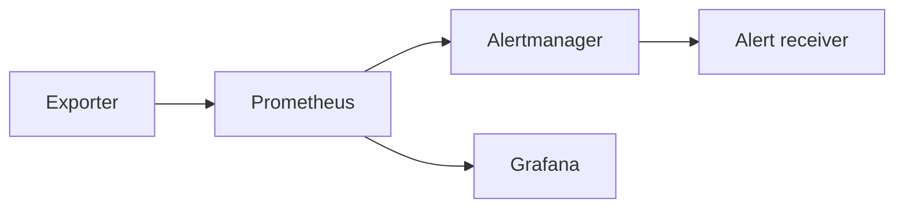

# Network observability platform

Docker-based monitoring stack for a small network and service lab. The repository shows how metrics, alert rules, alert routing, and dashboard provisioning fit together in a compact observability workflow.

It includes:

- a sample exporter that exposes network and service metrics
- Prometheus scraping and alert rules
- Alertmanager routing to a local receiver container
- Grafana provisioning with a small dashboard

The stack is intentionally compact so it can be brought up, checked, and modified without carrying a full platform around.

## What this demonstrates

- custom metric exposition from a Flask exporter
- Prometheus scrape configuration and alert rule validation
- Alertmanager webhook routing to a local receiver
- Grafana datasource and dashboard provisioning
- Docker Compose orchestration for a complete local monitoring path
- CI validation for configuration files and service behavior

## Layout

- `exporter/` contains the sample metrics app
- `alert-receiver/` contains the alert logging app
- `prometheus/` contains scrape config and rules
- `grafana/` contains provisioning and dashboard files
- `alertmanager/` contains the alert routing config
- `tests/` validates the configs and apps
- `diagrams/` contains the architecture sketch
- `screenshots/` is a placeholder only

## Local setup

```bash
python -m pip install -r requirements-dev.txt
```

## Run the stack

```bash
docker compose up --build
```

Useful endpoints:

- exporter metrics: `http://localhost:8000/metrics`
- alert receiver: `http://localhost:5000/healthz`
- Prometheus: `http://localhost:9090`
- Grafana: `http://localhost:3000`

## Architecture



## Validation

```bash
python scripts/validate_configs.py
pytest
```

CI runs the same validation on pushes and pull requests that touch the stack configuration, service code, tests, Docker Compose file, dependency file, or workflow.

## Cleanup

```bash
docker compose down -v
```
